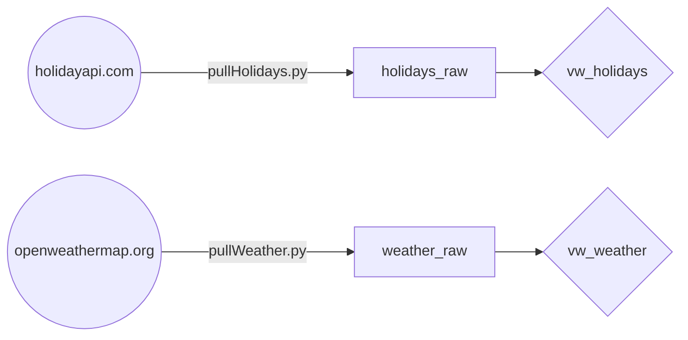

# parcelLab DE position


## Flow 


```mermaid
graph LR
H_API((holidayapi.com))--pullHolidays.py---> A[holidays_raw]  --> B{vw_holidays}
W_API((openweathermap.org))--pullWeather.py--->C[weather_raw]  --> D{vw_weather}

```

## How to run

```sh
 docker compose up -d
```
```sh
docker exec -it app sh
```

Then you can check cron, which is already started

```sh
crontab -l
```
